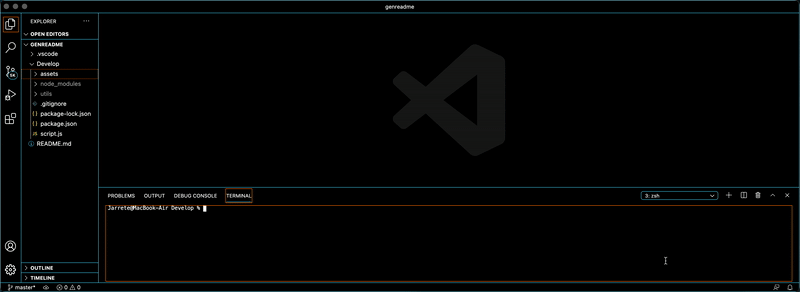

# README Generator

## Table of Contents

* Description
* Installation
* Usage
* Contributions
* Licensing
* Tests
* Questions

## Description

This project is a backend JavaScript application that combines inquirer prompts and writeFile method to create a professionally gratifying README file for users.

## Installation

The project can be cloned from this repository to a local repository that can be run in VS Code or coder of choice. Simply clone the https address of the repository.

## Usage

Developers can use this application to generate a fully professional README file from scratch with user inputs coordinated to templated contents. It offers a proper way to organize information pertaining to the subjective project you're creating.

## Contributions

This is a private project with no external contributors.

## Licensing

## Tests

Developers can either test or operate this application by opening Integrated Terminal within the appropriate global folder which the application resides. Npm install should not be necessary. Enter 'node script.js' in the command line of terminal, and run the prompts. Your answers with be conserved and entered into a data object, which will then be used to populate your README file.

## Questions

* You can follow my repositories at https://www.github.com/jarretebarnett
* For professional inquiries, you can email jarretebarnett@gmail.com

## Demo

